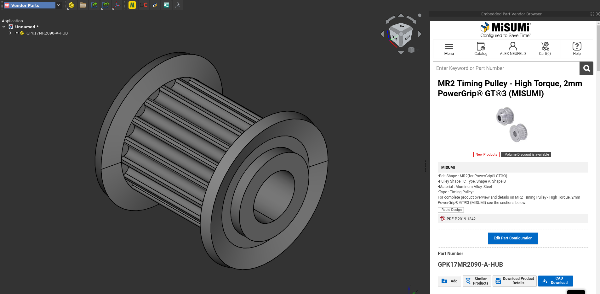

# FreeCAD Vendor Parts Addon

Adds the ability to import 3D models directly from catalogue websites of industrial suppliers into [FreeCAD](https://github.com/FreeCAD/FreeCAD).

### Requirements

- FreeCAD Version 0.19 (or LinkStage3)
- Online services that this addon accesses may require you to create an account in order to download files

### Installation

Installation via the Addon Manager is not supported yet.

Follow the **Manual Install** guide on [this page](https://wiki.freecadweb.org/How_to_install_additional_workbenches) for your OS

### Acknowledgements

- repository created from [this template](https://github.com/FreeCAD/freecad.workbench_starterkit)
- Some code adapted from [The 3DFindIt Workbench](https://github.com/cadenasgmbh/3dfindit-freecad-integration)
